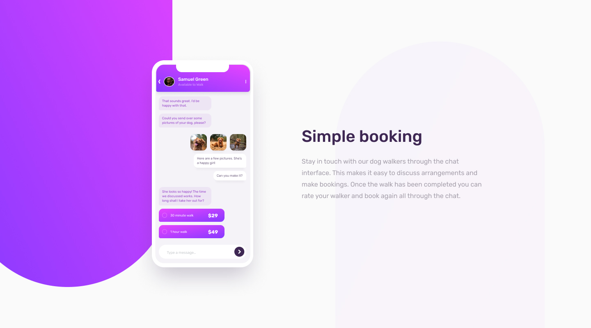

# CHAT APP CSS ILLUSTRATION SOLUTION

This is a solution to the HTML & CSS PORTFOLIO PROJECT 

[HTML & CSS Portfolio Project from Amalitech Training Academy](https://amalitech.org/). Amalitech seeks to Empower the next generation of technology leaders in Africa. 

## Table of contents

- [Overview](#overview)
  - [Customer Requirements](#the-requirement)
  - [Screenshot](#screenshot)
  - [Links](#links)
- [Our process](#our-process)
  - [Built with](#built-with)
  - [Future works](#future-works)
- [Authors](#authors)
- [Acknowledgments](#acknowledgments)

## Overview

### Customer Requirements

Users should be able to:

- View the optimal layout for the component depending on their device's screen size
- **Optional**: See the chat interface animate on the initial load

### Screenshot

### Links

- Solution URL: [https://github.com/justice-ellis/chat-app-css-illustration.git](https://github.com/justice-ellis/chat-app-css-illustration.git)
- Live Site URL: [https://justice-ellis.github.io/chat-app-css-illustration/](https://justice-ellis.github.io/chat-app-css-illustration/)

## Our process

### Built with

- Semantic HTML5 markup
- CSS custom properties
- [Animation](https://animate.style/) - CSS Library
- [Icons](https://fontawesome.com/) - Icon Library

### Future works

Future work on this project will seek to integrate javascript libraries and other css style components to enhance the visuals, interactivity and modifications to meet future customer demands.

## Authors

- Github -- [Justice Nana Ellis](https://github.com/justice-ellis)
- Email --- [justice.ellis@amalitech.org](justice.ellis@amalitech.org)

- Github -- [Emmanuel Odoi Odotei](https://github.com/emmanuel-odotei)
- Email --- [emmanuel.odotei@amalitech.org](emmanuel.odotei@amalitech.org)

## Acknowledgments

Thanks be to God Almighty for the gift of Life. Our sincere appreciation to the entire Amalitech Training Team especially Mr. Salami Suleiman for this timely enlightening project. We appreciate our abled colleagues who supported us in any way during the project. Thank you.

